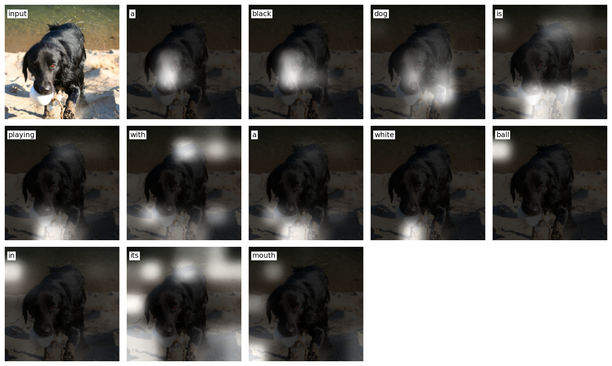

# capit

**A glass-box image captioner.** A *Show, Attend and Tell* model — frozen ResNet-50 encoder,
Bahdanau attention + LSTM decoder trained from scratch on Flickr8k — that shows its work:
every word, **where it looked** to say it, and the candidate captions it rejected. It runs
side-by-side with BLIP, deliberately framed as a *closed box*, so the contrast is the point.

**[▶ Live demo](https://capit-one.vercel.app)** &nbsp;·&nbsp;
[Model](https://huggingface.co/Bukunmi2108/capit-sat) &nbsp;·&nbsp;
[Backend (HF Space)](https://huggingface.co/spaces/Bukunmi2108/capit) &nbsp;·&nbsp;
[The paper](https://arxiv.org/abs/1502.03044)

<p align="center">
  
  <br />
  <em>Per-word attention: the model attends to the dark dog for “black dog”, then shifts to the
  white object at the mouth for “white ball … mouth”.</em>
</p>

## Why "glass box"

Most captioners hand you a sentence and nothing else. capit exposes its internals through the UI:

- **Word-by-word playback** — the caption types out, and the attention heatmap follows each word.
- **Attention heatmaps** — the 14×14 attention over the image, rendered in the paper's own style.
- **"The road not taken"** — the beam-search candidates it considered and rejected, with scores.
- **BLIP beside it** — a strong modern model shown bare (one caption, no internals) as an honest foil.

## Results

Test set (Karpathy split, 1000 images), scored with `pycocoevalcap`:

| decode | BLEU-1 | BLEU-2 | BLEU-3 | BLEU-4 | CIDEr |
|:------:|:------:|:------:|:------:|:------:|:-----:|
| greedy | 61.99 | 44.37 | 30.23 | 20.05 | 55.51 |
| beam 3 | 64.77 | 47.34 | 33.68 | **23.45** | 62.20 |
| beam 5 | 65.54 | 47.84 | 34.08 | **23.63** | 62.80 |

Trained on a single Colab T4; best validation BLEU-4 **19.62** at epoch 7 (early-stopped).
The attention is genuinely concentrated — top 5 of 196 cells hold ~32% of the mass — not diffuse noise.

## Architecture

```
image ──▶ ResNet-50 (frozen) ──▶ 14×14×2048 features
                                      │
                            Bahdanau attention  ◀── decoder hidden state
                                      │
                       context ──▶ LSTM decoder ──▶ next word + attention α
                                      │
                            beam search (length-normalized) ──▶ caption + per-word α + rejected beams
```

- **Encoder** — frozen ImageNet ResNet-50, spatial features (not pooled).
- **Decoder** — embedding + Bahdanau attention + `LSTMCell`, trained from scratch.
- **Training** — teacher forcing, cross-entropy + a doubly-stochastic attention regularizer (α_c = 1.0),
  early-stopping on validation BLEU-4.
- **Serving** — a self-contained artifact (`capit-sat.pt`: encoder + decoder weights, preprocess spec,
  vocab hash) that the backend rebuilds from; never the training checkpoint.

## Stack

| Component | Tech | Where it runs |
|---|---|---|
| `pipeline/` | Python · uv · PyTorch | training, evaluation, the serving artifact |
| `backend/` | FastAPI · uv · Docker | side-by-side `/caption` API → [HF Space](https://huggingface.co/spaces/Bukunmi2108/capit) |
| `frontend/` | Vite · vanilla TypeScript · **zero runtime deps** | the glass-box UI → [Vercel](https://capit-one.vercel.app) |

## Run it locally

**Backend** (loads the artifact from the Hub or a local `data/artifact/`):

```bash
cd backend && uv sync --extra dev
uv run uvicorn app:app --port 8000
```

**Frontend** (points at the local backend via `.env.development`):

```bash
cd frontend && npm install
npm run dev          # → http://localhost:5173
```

**Pipeline** (train / evaluate / export):

```bash
cd pipeline && uv sync --extra dev
uv run python -m capit.train --data-root ../data/flickr8k
uv run python -m capit.evaluate --ckpt ../data/checkpoints/best.pt
uv run python scripts/export_artifact.py
```

## Known limitation

ResNet-50 at 224px is natively **7×7**; the encoder upsamples it to 14×14, so each 2×2 attention
block is identical and the heatmaps are region-level (~32px), not pixel-precise. Captions are
grounded, but the spots are coarse. Sharper attention needs a retrain at 448px (true 14×14) —
a deliberate cost/quality trade-off documented rather than hidden.

## Acknowledgements

- Xu et al., [*Show, Attend and Tell*](https://arxiv.org/abs/1502.03044) (2015) — the architecture and the attention-visualization recipe.
- [BLIP](https://huggingface.co/Salesforce/blip-image-captioning-base) — the closed-box comparison.
- [Flickr8k](https://www.kaggle.com/datasets/adityajn105/flickr8k) (Karpathy split) — the dataset.
